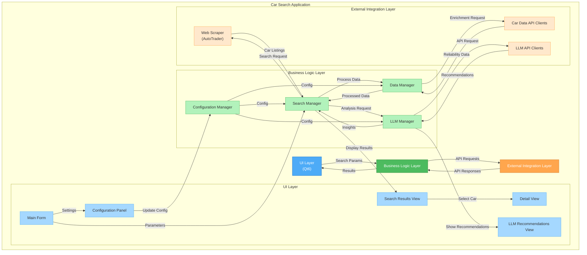
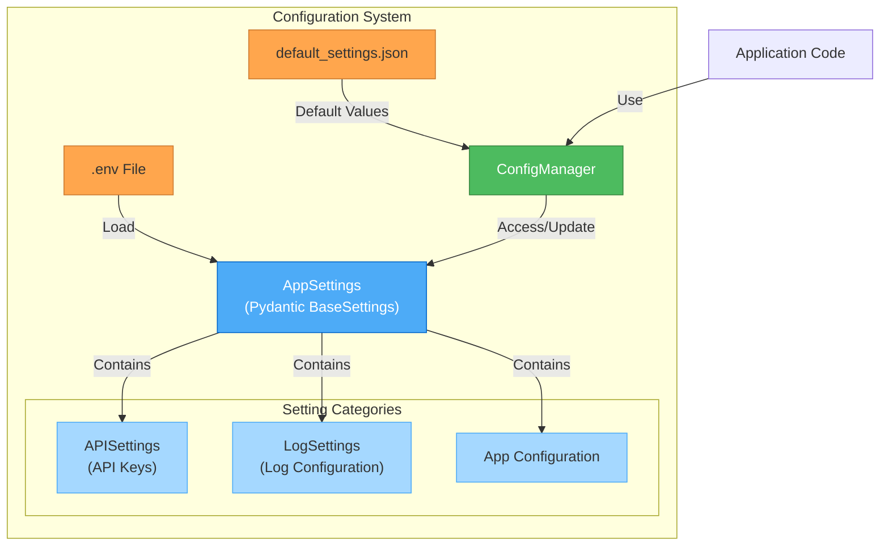
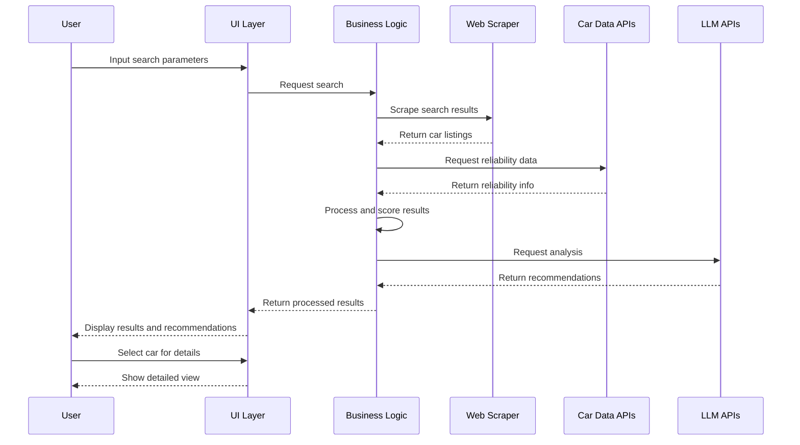

# Car Search Application Architecture

## System Overview

The Car Search application is designed with a modular architecture to enable clean separation of concerns, maintainable code, and flexibility for future enhancements. The system follows these core principles:

1. **Modularity**: Clear separation between UI, business logic, and external integrations
2. **Extensibility**: Support for multiple data sources and LLM providers
3. **Maintainability**: Well-defined interfaces between components
4. **Configurability**: External configuration for API keys and settings

## Component Architecture



## Configuration Management Design

The configuration management system is designed to securely handle API keys and application settings while providing flexibility and ease of use. After evaluating multiple approaches, a Pydantic-based solution was selected.

### Design Options Considered

1. **Environment Variables with dotenv**
   - Simple implementation using environment variables loaded from .env files
   - Good for secure storage of sensitive information
   - Limited structure for complex configurations

2. **YAML/JSON Configuration Files with Environment Variable Overrides**
   - Structured configuration with hierarchical organization
   - Human-readable format with version control for non-sensitive settings
   - More complex implementation than pure environment variables

3. **Database-Backed Configuration**
   - Structured data storage with schema validation
   - Support for runtime changes and user-specific settings
   - Most complex implementation with additional dependencies

4. **Pydantic Settings Management** (Selected)
   - Strong typing and validation of configuration values
   - Compatible with environment variables and configuration files
   - Extensible as requirements grow with good documentation

### Selected Approach: Pydantic Settings Management

The configuration system will use Pydantic's BaseSettings with the following components:



### Implementation Details

- **Directory Structure**:
  ```
  car_search/
  ├── config/                    # Configuration directory
  │   ├── .env                   # Environment variables (not in version control)
  │   ├── .env.sample            # Sample environment variables (in version control)
  │   └── default_settings.json  # Default settings (in version control)
  ```

- **Key Components**:
  1. **Pydantic Settings Models**: Typed models for different configuration categories
  2. **Configuration Manager**: Interface for accessing and updating settings
  3. **Environment Files**: Store sensitive values securely
  4. **Default Settings**: Provide fallback values for optional settings

- **Features**:
  - Secure storage of API keys via environment variables
  - Strong validation of configuration values
  - Support for hierarchical configuration structure
  - Runtime updates to non-sensitive configuration
  - Masked sensitive values in debugging output

### Benefits of Selected Approach

- Leverages existing Pydantic dependency in the project
- Provides type safety and validation
- Scales well as configuration requirements grow
- Follows Python best practices
- Supports secure handling of sensitive data
- Works well with both environment variables and configuration files

## Data Flow



## Component Details

### UI Layer

The UI layer is built using Qt6 and consists of the following components:

1. **Main Form**: Provides inputs for search parameters (postcode, radius, price range, etc.)
2. **Search Results View**: Displays the search results in a list or grid with sorting/filtering
3. **Detail View**: Shows detailed information for a selected car
4. **LLM Recommendations View**: Displays insights and recommendations from the LLM
5. **Configuration Panel**: Allows configuration of API keys, LLM providers, and other settings

### Business Logic Layer

The business logic layer handles the core application logic:

1. **Search Manager**: Coordinates the search process, from input validation to result display
2. **Data Manager**: Handles data processing, enrichment, and scoring
3. **LLM Manager**: Manages interactions with LLM providers, including prompt engineering
4. **Configuration Manager**: Manages application settings and API configurations

### External Integration Layer

The external integration layer manages interactions with external services:

1. **Web Scraper**: Handles scraping of AutoTrader search results
2. **Car Data API Clients**: Integrates with car reliability data sources
3. **LLM API Clients**: Connects to LLM providers (primarily Google Gemini)

## Module Structure

The project will follow this directory structure:

```
car_search/
├── src/
│   ├── ui/              # Qt6 UI components
│   ├── core/            # Core application logic
│   ├── search/          # Search and web scraping
│   ├── data/            # Car data integration
│   ├── llm/             # LLM integration
│   └── config/          # Configuration management
├── tests/               # Test modules
├── docs/                # Documentation
└── config/              # Configuration files
```

## Configuration Management

Configuration will be managed through:

1. Environment variables for sensitive information (API keys)
2. Configuration files for application settings
3. UI settings panel for user-configurable options

## Technical Considerations

### Performance

- Implement caching for web scraping results to reduce redundant requests
- Optimize data processing for large result sets
- Manage LLM API usage efficiently to minimize costs

### Security

- Store API keys securely using environment variables
- Validate user input to prevent injection attacks
- Implement proper error handling without leaking sensitive information

### Extensibility

- Use abstract interfaces for external integrations
- Implement provider pattern for LLM integrations
- Design for easy addition of new data sources

## Implementation Priorities

1. **Core infrastructure**: Project structure, configuration, basic UI
2. **Search functionality**: Web scraping and basic result display
3. **Data enrichment**: Integration with car data APIs
4. **LLM integration**: Connect with Google Gemini for analysis
5. **Advanced features**: Comparison tools, saved searches, etc.

## Risk Assessment

| Risk | Likelihood | Impact | Mitigation |
|------|------------|--------|------------|
| Web scraping blocked | Medium | High | Respectful crawling, fallback options |
| API rate limiting | Medium | Medium | Caching, request throttling |
| LLM cost increases | Low | Medium | Usage tracking, provider abstraction |
| Cross-platform issues | Medium | Low | Regular testing, minimal platform-specific code | 